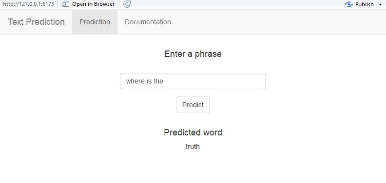
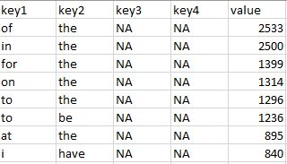

Data Science Capstone Presentation
========================================================
author: Matt Dlubac
date: 1/11/18
autosize: true

Capstone Project - Text Prediction Application
========================================================

The purpose of this capstone project was to create an application where users could input a phrase and receive a prediction of the next word in the phrase.

The application uses data from twitter, news articles, and blogs to generate n-grams (groups of 2, 3, and 4 words), which are then compared against the user input to find the most probable next word.

The n-grams are precalculated and read in at run time. This greatly decreases memory usage and processing time. It also allows for new or updated n-gram lists to be easily integrated into the application.

Usage Instructions
========================================================

- As seen below, users can enter a phrase into the textbox
- Clicking the predict button will take the entered phrase and run it though the prediction algorithm
- The result of the prediction algorithm is displayed below the "Predicted word" header

Application Breakdown
========================================================

Below is a general outline how the application functions:
- On startup the pregenerated n-grams are read in from a csv file
  - A notification is displayed while the file is being loaded. The prediction algorithm will not run until the loading is complete.
  
- When the predict button is clicked:
  - The entered text is sanitized of all non-alphanumeric characters. If there are no alphanumeric characters a message is displayed and the prediction algorithm is not run.
  - If the input is longer than three words only the final three are considered
  - The final 1-3 words are sent to the prediction algorithm. If a prediction cannot be made the first word is removed and the prediction is run again until there is a successful prediction or no words remain.
  - The prediction is displayed below the "Predicted word" header

Prediction Algorithm
========================================================
left: 80%

This slide describes how the prediction algorithm functions. At this point of the application execution the pregenerated n-grams have been read into a table that allows for simple lookups (see example in screenshot)

- The user entered text is sanitized and split into individual tokens (words)
- A loop is run based on the number of tokens
  - The lookup table is filtered so that the first column matches the first token, the second column matches the second token, and so on
  - After all columns are matched the filtered table is returned from the function. The first row in the table is considered to be the final prediction
  - If after filtering the table it has no rows left (no matching n-grams) the first token is removed and the algorithm is recursively called. This continues until a prediction can be made or there are no tokens remaining. If no tokens are left a null value is returned
  
***
  

